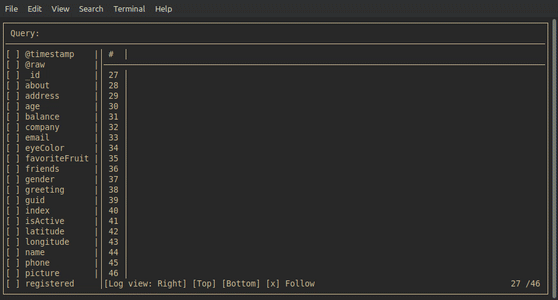

# Monaλog

Monalog is terminal logs observer. It currently supports only json input (either from file or with pipe)

## Installation
  1. Clone the repo
  2. $ cabal install exe:monalog
  3. Enjoy

## Running 
You can feed log either with pipe:
```bash
m_logging_program | monalog 
```
or from file:
```bash
monalog logs.json
```
## Usage
* To exit use Ctrl+d
* Mouse wheel to scroll vertically
* Mouse wheel + Ctrl to scroll horizontally when not all of columns fit in viewport
* Click on log entry twice to see whole one
* Esc to hide whole log entry view

## Demo

---
Thanks to [@ShrykeWindgrace](https://github.com/ShrykeWindgrace) for help with Windows support implementation